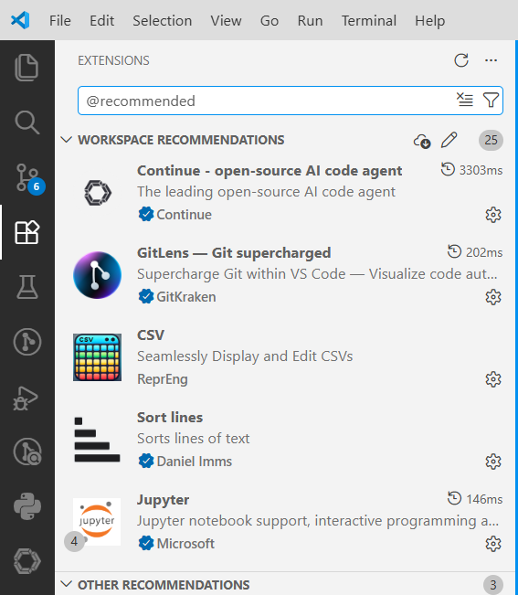

# How to setup this code repo locally

> ⚠️ mind all the inline links. They are helpful :-)

## 1. System setup

A handful of applications need to be installed directly onto your OS. These are all listed in files contained within this repo, which can be directly parsed by a package manager. Exact steps depend on which OS you have:

### Windows

Download the file `configuration.winget` from the repo's top-level directory, then open your Downloads-folder and double-click the file.

> Installation may take a while depending on the speed of your PC and internet connection.
>
> During installation, you may be asked to grant admin privileges multiple times. Please do so. Installers are all official and verified.

### MacOS or Linux

1. Install [Homebrew](https://brew.sh/)
2. Download the file `Brewfile` from the repo's top-level directory
3. Open a terminal, `cd` to your download folder, and run this command:

  ```bash
  brew bundle install --file Brewfile
  ```

## 2. Clone Git repo via VSCode

See this [offical guide](https://code.visualstudio.com/docs/sourcecontrol/repos-remotes#_clone-repositories).

## 3. Install all recommended VSCode extensions

VSCode should prompt you for exactly that right after cloning the repo. If so, click *Yes*. If not, go to the extensions tab in the left sidebar, enter `@recommended` in the search bar and install all manually:



## 4. Install all Python dependencies via UV

Open an integrated terminal in VSCode (e.g. via shortcut `CTRL` + `Ö`) and enter `uv sync`. This should rather quickly install all required packages, as defined in `pyproject.toml`.

> If you have trouble executing `uv` in the terminal, try restarting VSCode or installing UV again [via the official script](https://docs.astral.sh/uv/#__tabbed_1_2).
